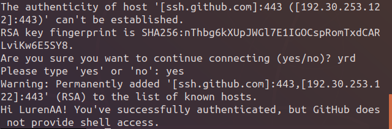

```bash
cd 
vim .ssh/config
```
你会发现这是一个新文件，在其中添加以下文字：

```bash
Host github.com
User 你的用户名（例如97860xx@qq.com）
Hostname ssh.github.com
PreferredAuthentications publickey
IdentityFile ~/.ssh/id_rsa
Port 443
```
然后保存退出（代码如下）。
```bash
:wq
```

接下来测试一下：
```bash
ssh -T git@github.com
```
出现下面的画面：

在图片倒数第五行的地方会询问是否建立连接，输入yes即可。